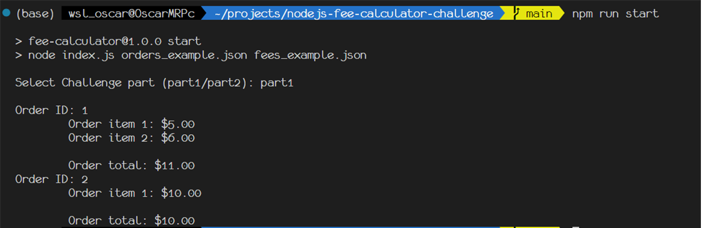
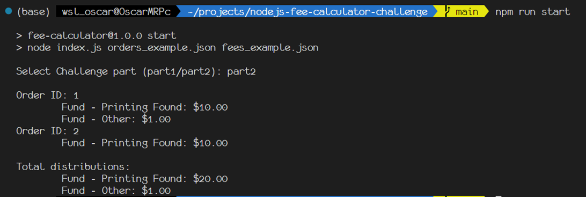
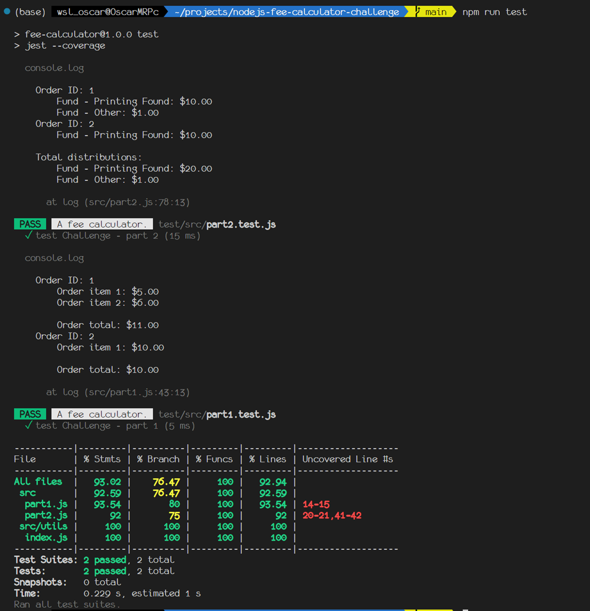

# HOW TO RUN:

 - npm i
 - npm run start
 - npm run test

1.- Install Node.js dependencies with:

    npm i

2.- Run the chalenge with

    node index.js orders_example.json fees_example.json

 or
    
    npm run start


Note: if you wanna choose ```npm run start``` then your going to need to enter the text 

    part1
or
    
    part2

Example:






3.- Run Jest unit test with

    npm run test

